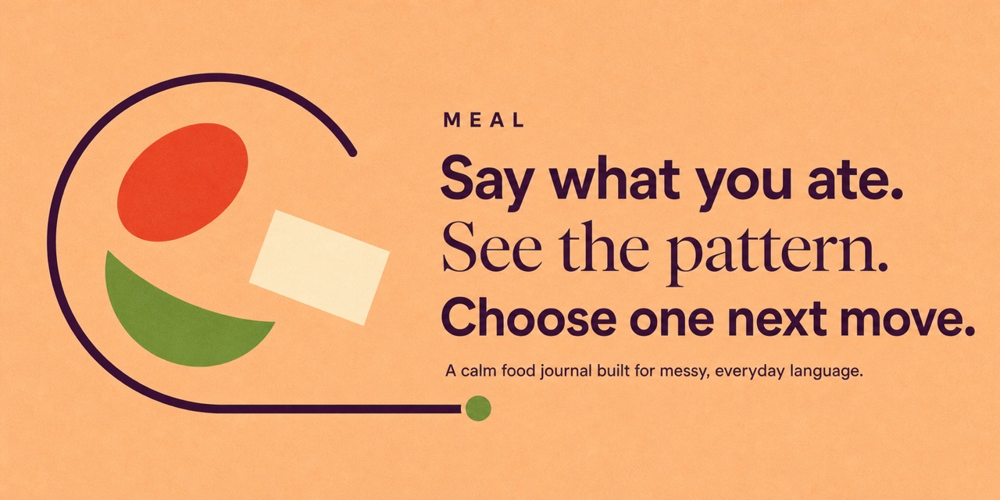
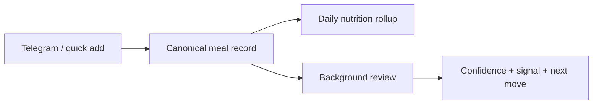

<p align="center">
  
</p>

<p align="center">
  <a href="https://lemma.work"></a>
  
  
</p>

<p align="center">
  <strong>Tell Telegram what you ate. Get a calm, durable picture of your nutrition.</strong><br/>
  <sub>A food journal that turns messy meal language into daily totals, confidence signals, and one useful next move.</sub>
</p>


## The product loop

<table>
  <tr>
    <td align="center" width="25%">
      <strong>01</strong><br/>
      Describe a meal
    </td>
    <td align="center" width="25%">
      <strong>02</strong><br/>
      Write meal + daily rollup
    </td>
    <td align="center" width="25%">
      <strong>03</strong><br/>
      Review in background
    </td>
    <td align="center" width="25%">
      <strong>04</strong><br/>
      Show one useful signal
    </td>
  </tr>
</table>



## Why this is a Lemma pod

<table>
<tr>
    <td width="50%" valign="top">
      <h3>Natural capture</h3>
      <p>Log a meal in ordinary language from Telegram or the compact web application.</p>
    </td>
    <td width="50%" valign="top">
      <h3>Durable totals</h3>
      <p>A canonical write updates the meal journal and chart-ready daily nutrition rollup.</p>
    </td>
  </tr>
<tr>
    <td width="50%" valign="top">
      <h3>Gentle review</h3>
      <p>A specialist materializes confidence, attention signals, and one useful next move.</p>
    </td>
    <td width="50%" valign="top">
      <h3>Replay safe</h3>
      <p>Dedupe keys keep repeated delivery from creating duplicate meals.</p>
    </td>
  </tr>
</table>

This repository is a complete Lemma pod bundle: state, agent instructions, deterministic functions, workflows or schedules, permissions, application metadata, and the interface people actually use. The useful unit is the running system—not an isolated prompt or demo page.

## What is inside

| Layer | Role |
| --- | --- |
| **App** | The calm, purpose-built surface people operate |
| **Agents** | Judgment, research, drafting, or review with explicit instructions |
| **Tables** | Durable state that survives every conversation and run |
| **Functions** | Deterministic writes and guarded side effects |
| **Workflows / schedules** | The continuing loop that notices and acts |
| **Files** | Native knowledge and artifacts when the pod needs them |

## Run it

### Import the pod

```bash
git clone https://github.com/deepak-jha-kgp/meal.git
cd meal

lemma pods import . --dry-run
lemma pods import .
```

Connector accounts, credentials, member IDs, live records, and uploaded file bytes are intentionally not stored in this repository. Configure those in your own Lemma environment after import.

## Repository map

```text
.
├── pod.json                 # pod identity
├── tables/                  # durable state
├── functions/               # deterministic operations
├── agents/                  # specialist instructions + permissions
├── workflows/               # multi-step processes, when used
├── schedules/               # time/event triggers, when used
├── apps/                    # deployed application bundle
├── docs/                    # visuals + implementation notes
└── README.md
```

Not every pod needs every resource type. The bundle only includes the machinery required by this product loop.

## Trust boundary

- Agent work lands in durable, inspectable state.
- Sensitive outside actions remain guarded by application or approval logic.
- Credentials and connected accounts never belong in the repository.
- Human decisions are part of the system, not an exception path.

## Go deeper

- [Implementation notes](./docs/implementation-notes.md)
- [Social preview](./docs/social-preview.jpg)
- [Build on Lemma](https://lemma.work)

## Share

<p>
  <a href="https://twitter.com/intent/tweet?text=Meal%20%E2%80%94%20Tell%20Telegram%20what%20you%20ate.%20Get%20a%20calm%2C%20durable%20picture%20of%20your%20nutrition.&url=https%3A%2F%2Fgithub.com%2Fdeepak-jha-kgp%2Fmeal"></a>
  <a href="https://www.linkedin.com/sharing/share-offsite/?url=https%3A%2F%2Fgithub.com%2Fdeepak-jha-kgp%2Fmeal"></a>
  <a href="https://bsky.app/intent/compose?text=Meal%20%E2%80%94%20Tell%20Telegram%20what%20you%20ate.%20Get%20a%20calm%2C%20durable%20picture%20of%20your%20nutrition.%20https%3A%2F%2Fgithub.com%2Fdeepak-jha-kgp%2Fmeal"></a>
</p>

---

<p align="center">
  <sub>People use the app. Agents work through the system. The result stays.</sub>
</p>
